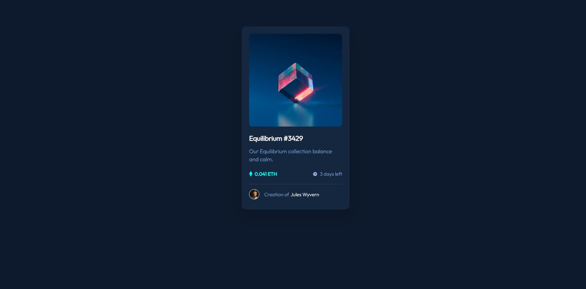

# Frontend Mentor - NFT preview card component solution

This is a solution to the [NFT preview card component challenge on Frontend Mentor](https://www.frontendmentor.io/challenges/nft-preview-card-component-SbdUL_w0U). Frontend Mentor challenges help you improve your coding skills by building realistic projects.

## Table of contents

-   [Overview](#overview)
    -   [The challenge](#the-challenge)
    -   [Screenshot](#screenshot)
    -   [Links](#links)
-   [My process](#my-process)
    -   [Built with](#built-with)
    -   [What I learned](#what-i-learned)
    -   [Continued development](#continued-development)
-   [Author](#author)

## Overview

### The challenge

Users should be able to:

-   View the optimal layout depending on their device's screen size
-   See hover states for interactive elements

### Screenshot

### Links

-   Solution URL: [Add solution URL here](https://github.com/Taro-Naza/nft-preview-card)
-   Live Site URL: [Add live site URL here](https://nft-preview-card-project-deploy.netlify.app)

## My process

### Built with

-   Semantic HTML5 markup
-   Flexbox
-   [SCSS](https://sass-lang.com/) - for styles

### What I learned

I have not use anything new, the point of this project is to write something small and simple in HTML and CSS since I have been using frameworks so quiet sometime now, it is a bit nostalgic 😆

### Continued development

I am trying in getting better at writing more accessibele HTML and modulare CSS and keeping the total size of my projects as light as possible

## Author

-   Website - [Tarek Maza](https://www.linkedin.com/in/tarekmaza/)
-   Frontend Mentor - [@Taro-Naza](https://www.frontendmentor.io/profile/Taro-Naza)
